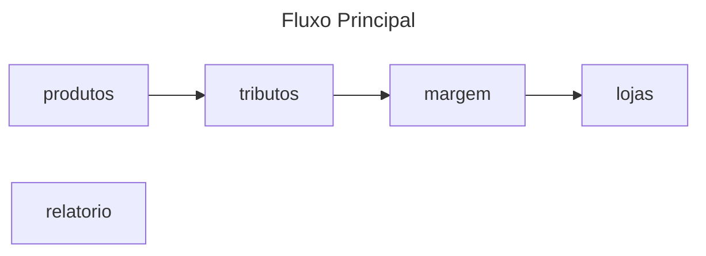

# Aula 3

## Proposta da Atividade da 1ª Parte
- Criar User Story, definindo persona, pre-condições, pos-condições, fluxo principal e fluxo de exceção para o trabalho da aula 2.

## Corpo da atividade
- Persona: empreendedor que trabalha com revendas por e-commerce.
- Pré-condições: o usuario precisa ter os dados do produto a ser cadastrado e conhecer todos os encargos que se aplicam sobre os produtos e sobre sua empresa.
- Pós-condições: o sistema organiza os produtos, vinculando-os com todas as informações pertinentes com base na categoria, nos dados da empreesa e nas lojas cadastradas.
- Fluxo Principal:
    - Cadastrar produtos com preço de custo e categoria (tag);
    - Cadastrar tributos coletados e vincular às categorias em que se aplicam;
    - Cadastrar margem de lucro desejada;
    - Cadastrar lojas (marketplaces) onde se pretende vender os produtos, vinculando com as lojas predefinidas pelo sistema;
    - Consultar relatorio de preços do produto ou categoria desejado.
- Fluxo de Exceção:
    - O produto pode ter informações incompletas (o sistema pode responder com um erro indicando as informações que faltam);
    - Os valores de tributo e margem de lucro podem não fazer sentido, por exemplo sendo maior que 100% (o sistema pode reforçar a unidade);
    - O cliente pode cadastrar uma loja que não possuem configurações pré-definidas (o sistema pode guiar o usuário em como configurar ele mesmo); 

## Feedback
- Funcionalidade de cadastrar compras recorrentes (portanto, cadastro de fornecedores
- Foco maior nos erros de interpretação pela unidade)

## Fluxograma

## Proposta da Atividade da 2ª Parte
- Criar diagrama de casos de uso (UML) destacando usuários, aplicações e vínculos
