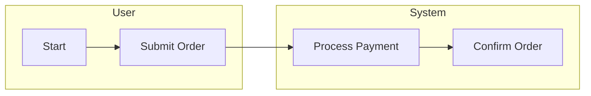

## Proposta da Atividade da 2ª Parte
- Criar diagrama de casos de uso (UML) destacando usuários, aplicações e vínculos

```mermaid
flowchart LR
    subgraph Role_A [User]
        Start --> A1[Submit Order]
    end
    subgraph Role_B [System]
        A1 --> B1[Process Payment]
        B1 --> B2[Confirm Order]
    end

``` 
